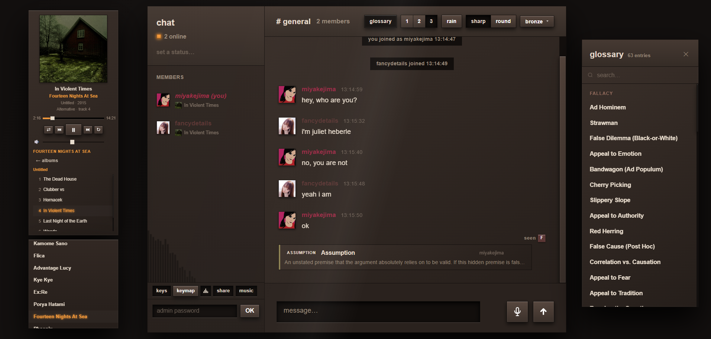
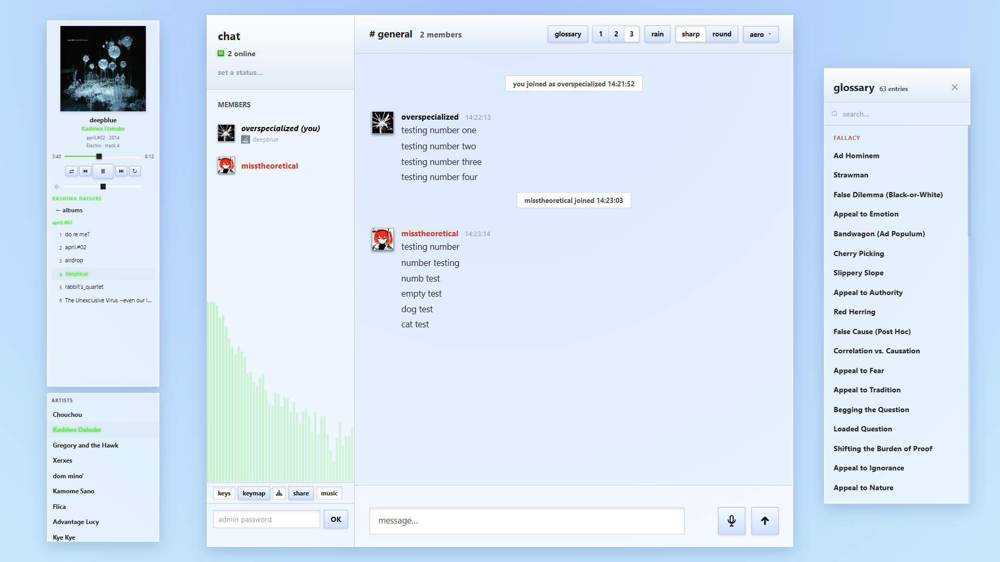
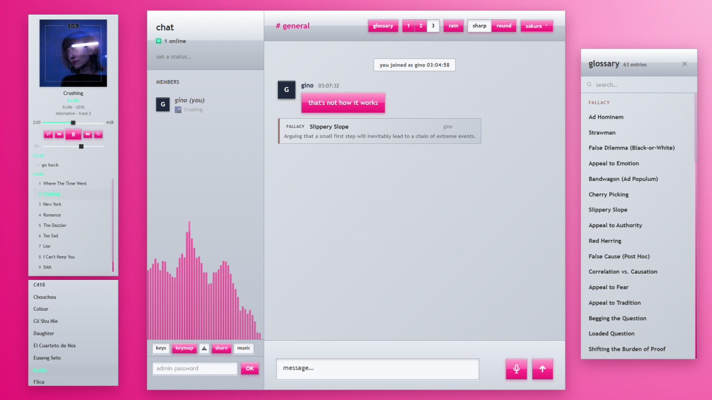
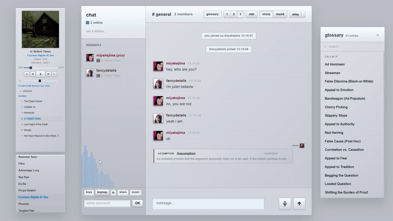
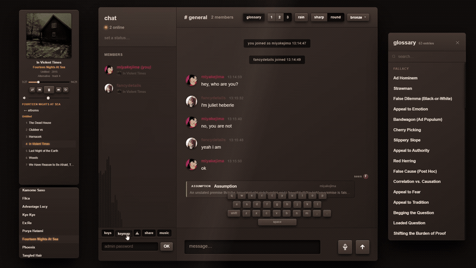
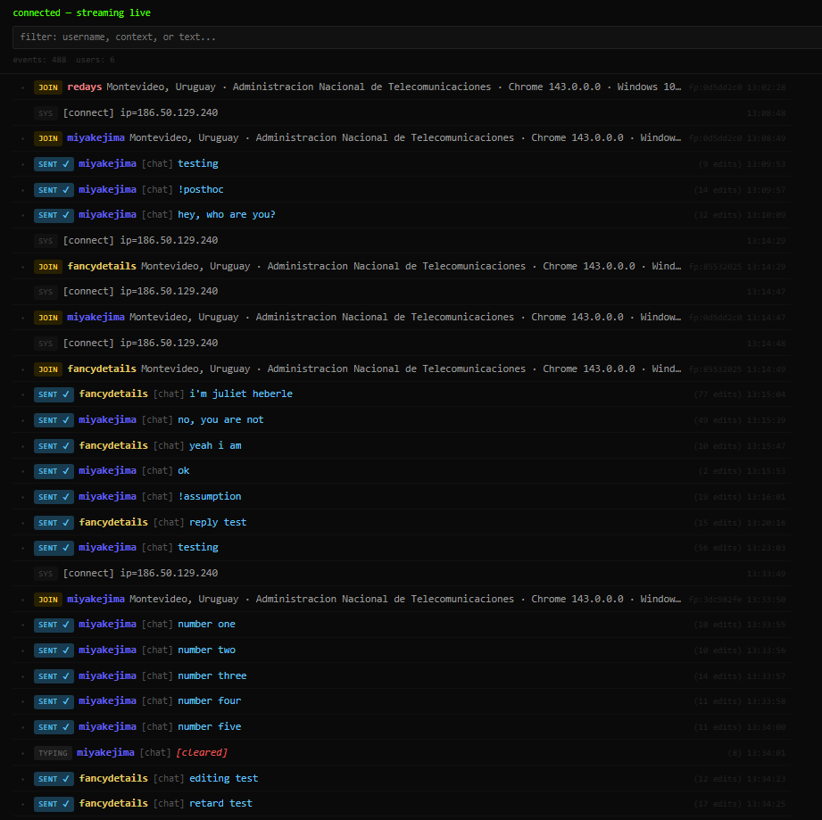

<div align="center">

# cathedral

[](https://redays.onrender.com/)&nbsp;
[](https://nodejs.org/)&nbsp;
[](LICENSE)&nbsp;


**Real-time WebSocket chat with ambient rain, E2E-encrypted DMs, procedural audio, and a full CSS theme engine.**  
Built entirely with vanilla JavaScript and Node.js — no framework, no bundler, no build step.

</div>

---

<div align="center">
  
</div>

<br/>

<div align="center">
  &nbsp;
  
</div>

---

## 🎨 Themes

Nine hand-crafted CSS themes. Cycle with **`T`** or scroll the theme button — no page reload.



The theme engine reads `themes.css` at runtime and auto-populates all dropdowns. **Adding a new theme requires editing one CSS file — no JS or HTML changes needed.**

| Theme | Style |
|---|---|
| Anodized Bronze | Warm bronze dark |
| Vista Grey | Cool grey dark |
| Aero Blue | Blue-tinted dark |
| AMOLED | True black |
| Sharp Minimal | Flat dark |
| Sakura Y2K | Pink pastel |
| Graphite Skeuo | Textured dark with noise grain |
| Machined Alloy | Cold gunmetal |
| Polycarbonate Clear | Translucent light |

See [`themedocumentation.txt`](themedocumentation.txt) for the full CSS variable reference, hardcoded value inventory, and a copy-paste template.

---

## 🎬 Feature Showcase



---

## 💬 Messaging

Real-time bidirectional WebSocket with automatic silent reconnect and an offline message queue — messages typed during a disconnect flush automatically on rejoin.

#### Editing & replies

- **Edit** — press <kbd>↑</kbd> on an empty input to edit your last message; <kbd>Esc</kbd> cancels; `(edited)` appended on send
- **Quote reply** — hover the reply button or double-click any message; <kbd>↓</kbd> (empty input) replies to the last other message; clicking a quoted preview scrolls and flashes the original
- **Typing indicators** — throttled broadcast; shows "X is typing…", "X and Y are typing…", or "several people are typing…"; auto-clears after 3 s

#### Media

- **Paste images** — paste from clipboard directly into the input; compressed client-side, previewed before sending
- **Image lightbox** — click any image for a full-size overlay; close with <kbd>Esc</kbd> or backdrop click
- **Read receipts** — colored avatar dots appear below your message as each user reads it

#### Cards

- **Taxonomy cards** — type `!query` to match and broadcast a glossary card to the entire room

---

## 📩 Direct Messages

Floating windows per conversation — draggable, minimizable, closeable, z-index managed. Right-click any user in the sidebar to open a DM.

#### Desktop

Up to 5 staggered floating DM windows simultaneously. Each window is independently draggable, minimizable to a pill in the sidebar footer, and closeable without affecting other conversations.

#### Mobile

DMs go full-screen. Hidden DMs collapse into draggable **floating chat bubbles** — similar to Messenger — with unread count badges and viewport edge snapping. Hardware back button closes open DM windows via the History API. Swipe right (>80 px) dismisses a DM.

DM input is disabled while the peer is offline and re-enables automatically on rejoin.

---

## 🔒 End-to-End Encryption

> The server is a blind relay — it cannot read the content of any direct message.

All DMs are encrypted client-to-client using **ECDH P-256** key exchange and **AES-GCM-256** per-message encryption, implemented entirely through `crypto.subtle` with zero dependencies.

- **Ephemeral keys** — fresh keypair generated on every connection; private keys are non-extractable from the browser
- **12-byte random IV** per message, never reused — ciphertext format: `base64(iv[12] + ciphertext)`
- On join each user broadcasts their public key; the server only relays it
- Failed decryption renders `[🔒 decryption failed]`; successful decryption shows a lock icon

---

## 🎙 Voice Messages

Record with the mic button; click again to cancel. Send to transmit. Maximum 60 seconds at 128 kbps / 48 kHz mono.

Playback renders an animated **44-bar waveform canvas** driven by `AnalyserNode` — click anywhere on the bar to seek.

---

## 🎧 Listen Together

Listen Together lets anyone in the room **share their playback with everyone else in real time**. When a user starts broadcasting, all others can sync to their track — same position, perfectly in step.

#### How it works

- The **host** broadcasts full playback state: track URL, position, play/pause state, title, artist, album art, and a `sentAt` timestamp used for latency correction on the subscriber side
- **Listeners** subscribe via the server, which routes sync packets only between the host and their active subscribers
- On rejoin, a listener can request a re-sync from the host without disrupting anyone else
- When the host disconnects, the server automatically releases all their listeners

#### Presence

A **"Listening with X"** badge appears next to every active listener in the user list — visible to the whole room. Listeners can leave independently at any time.

---

## 🎵 Music Player

Streams from Cloudflare R2 CDN via a bundled `music.json` catalog. Displays track title, artist, and album art with play/pause, next/previous, and a seek bar. Now-playing status is broadcast to all peers and shown in the sidebar.

---

## 🌧 Ambient Rain

Three-layer physics simulation — **far** (90 drops), **mid** (110 drops), **close** (60 drops) — with individual speed, length, opacity, width, and wind variance per drop. Move your cursor near the rain and drops deflect proportionally to distance and layer depth; wind decays per frame at 0.92 damping.

Drop color is fully theme-customizable via `--rain-r`, `--rain-g`, `--rain-b`. Backed by a gapless `WebAudio`-decoded loop that fades in over 2.0 s and fades out over 1.5 s.

#### Lightning

Fires at random intervals (2.5–7 minutes) while rain is on. Plays a decoded strike audio clip; **bass amplitude drives a canvas overlay opacity in real time** — the flash brightens and dims with the actual waveform.

---

## 🖱 Peer Cursor Tracking

Mouse positions broadcast to all connected users at ~60 fps. Each peer gets a **colored dot + username pill** following their cursor via a RAF animation loop. Cursors fade after 4 s of inactivity and are removed on disconnect.

---

## ⌨️ Mechanical Keyboard Sounds

Full QWERTY plus Space, Enter, Backspace, Tab, Shift, CapsLock, brackets, and arrows — each key mapped to its own **NK Cream** `.wav` sample at 0.55 gain. Toggle in the sidebar. Preloads on first use.

#### Keymap Overlay

A floating draggable visual keyboard that **flashes each key as it is pressed**, with <kbd>Shift</kbd> toggling labels to uppercase. Toggle with <kbd>Right Shift</kbd> or the sidebar button. Desktop only.

---

## 🛡 Admin

Protected by `ADMIN_PASSWORD` env var. Max 5 auth attempts before the connection is closed. One session at a time — new auth revokes the previous.

| Action | Options |
|---|---|
| **Kick** | 1 min · 5 min · 1 hour · permanent |
| **Mute** | 1 min · 5 min · 30 min · 1 hour |
| **Unmute** | Immediate |
| **Unban** | Clears kick record |
| **Purge** | Removes all messages from a user on every client |

**Live log stream** served at `/logs?key=ADMIN_LOG_SECRET`. A wrong or missing key returns 404 — the endpoint's existence is never disclosed. The viewer provides color-coded event types, username search, pause/resume auto-scroll, export to `.txt`, and auto-reconnect.

<div align="center">
  
</div>

---

## ⌨️ Keyboard Shortcuts

| Key | Action |
|---|---|
| <kbd>T</kbd> | Cycle theme forward |
| <kbd>1</kbd> / <kbd>2</kbd> / <kbd>3</kbd> | Bubble · Cozy · Compact message layout |
| <kbd>G</kbd> | Open / close glossary panel |
| <kbd>↑</kbd> (empty input) | Edit your last sent message |
| <kbd>↓</kbd> (empty input) | Reply to the last other user's message |
| <kbd>Esc</kbd> | Cancel edit or reply |
| <kbd>Right Shift</kbd> | Toggle keymap overlay |
| Scroll on theme button | Cycle themes backward / forward |

---

## 👤 Identity & Presence

- **Usernames** — 1–24 chars, case-insensitive uniqueness enforced server-side
- **32 color presets** — pick on join, change any time in the sidebar; broadcast instantly to all peers
- **Avatars** — upload any image → resized to 128×128 JPEG in-browser, stored in `localStorage`; dominant color auto-sets your user color
- **Status** — custom text up to 48 chars or a preset grid; persists across reconnects
- **Page title** — `(N) chat · M online` where N is the unread count

---

## 🔊 Sound System

All notification sounds are synthesized at runtime via Web Audio API — no audio files for UI events.

| Event | Sound |
|---|---|
| Receive message | Two-note bell (C6 + E6) |
| Send message | Air puff + 700 Hz sine |
| User joins | Three ascending triangle tones (C5, E5, A5) |
| User leaves | Descending sine fade (A4 → F4) |
| Reconnect | Two soft pings (A5, C6) |
| Error | Low noise buzz (150–600 Hz) |
| Button click | Cloth-like tap (900–7000 Hz burst) |
| Admin login | Triumphant 4-note chord |
| Purge | Downward thud (noise + 120 Hz sine) |

---

## 🖱 Custom Cursors

Five cursor packs selectable in the sidebar: **Baldur's Gate 3**, **Diablo II**, **Diablo IV**, **Morrowind**, and **Supple / Andrea** (animated sets).

---

## 📱 Mobile

- **Sidebar** — hamburger → slide-in; swipe left to close
- **iOS keyboard** — input bar shifts correctly on open via the Visual Viewport API
- **Long-press** (550 ms) on any message → action sheet with reply / edit options
- **DM bubbles** — draggable with viewport edge snapping
- **Back gesture** — History API closes open DM windows; physical back button works on Android

---

## ⚙️ Server

> Pure Node.js — no Express, no framework, no ORM. `node server.js` and you're running.

- Path traversal protection on the static file server
- `?v=N` cache-busting replaced at serve time with actual file mtime; static assets served with 1-year immutable cache headers
- `X-Content-Type-Options: nosniff` and `X-Frame-Options: DENY` on all responses
- WebSocket heartbeat every 7 s server-side; client keepalive every 9 s
- Per-IP connection cap: **10 concurrent WebSocket connections**
- Rate limiting: **10 messages per 5-second sliding window** per user
- Max WebSocket payload: **2 MB**
- Graceful shutdown: SIGTERM broadcasts a restart notice to all clients, then closes connections cleanly; 5 s hard-kill fallback
- Self-ping keep-alive for platforms that sleep free instances (`RAILWAY_PUBLIC_DOMAIN` / `SELF_URL`)

---

## 🚀 Getting Started

```bash
git clone https://github.com/miyakejima/cathedral-chat.git
cd cathedral-chat
npm install
npm start
```

Open `http://localhost:3000`.

### Environment Variables

| Variable | Description |
|---|---|
| `PORT` | HTTP/WebSocket port (default `3000`) |
| `ADMIN_PASSWORD` | Enables the in-app admin toolkit |
| `ADMIN_LOG_SECRET` | Enables the `/logs` live stream endpoint |
| `ALLOWED_ORIGIN` | Restricts WebSocket origin (e.g. `https://your-domain.com`) |
| `RAILWAY_PUBLIC_DOMAIN` | Self-ping domain to prevent Railway sleep |
| `SELF_URL` | Alternative self-ping URL |

Deploys to Render, Railway, Fly.io, or any platform that runs `node server.js`.

---

## 🗂 Codebase

```
/
├── server.js                   # Node.js backend — HTTP, WebSocket, rate limiting, admin
├── themedocumentation.txt      # Full CSS variable reference + theme authoring template
├── public/
│   ├── index.html
│   ├── css/
│   │   ├── themes.css          # All 9 themes + CSS custom property definitions
│   │   ├── style.css           # Layout, components, mobile media queries
│   │   └── music.css
│   ├── js/
│   │   ├── main.js             # WebSocket, message rendering, core state
│   │   ├── ui.js               # Theme engine, layout, modals, viewport handling
│   │   ├── audio.js            # Web Audio API synthesizers
│   │   ├── e2e.js              # ECDH + AES-GCM end-to-end encryption
│   │   ├── dm.js               # DM window manager + mobile bubble logic
│   │   ├── rain.js             # Canvas rain physics + ambient audio loop
│   │   ├── ambient.js          # Lightning, peer cursors, keymap overlay, NK Cream sounds
│   │   └── audio-recorder.js   # Microphone capture, waveform visualization
│   ├── sounds/                 # NK Cream .wav samples (per-key)
│   └── cursors/                # Custom cursor packs (.cur .ani .crs)
└── docs/
    └── media/                  # Screenshots and animated demos
```

---

## 📄 License

MIT
